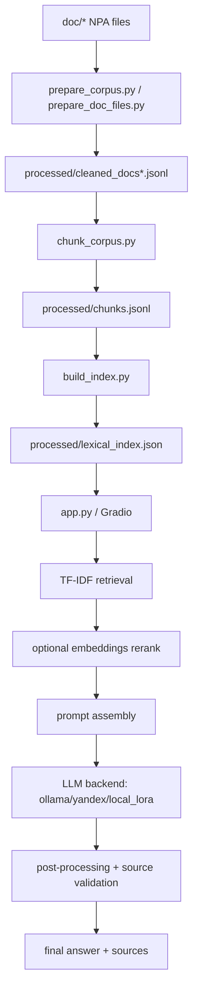
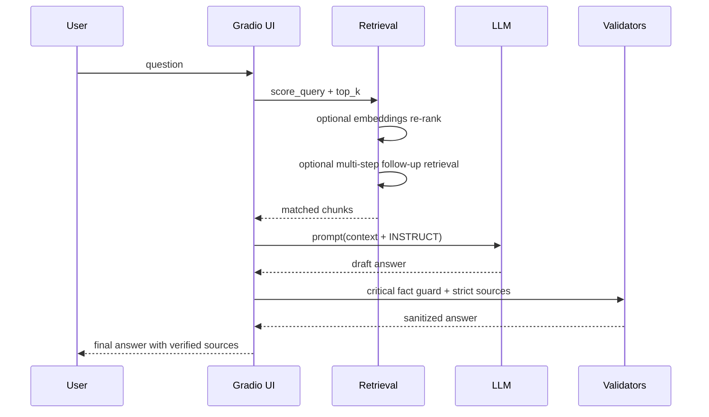
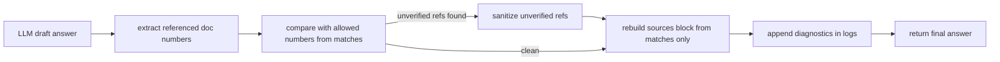
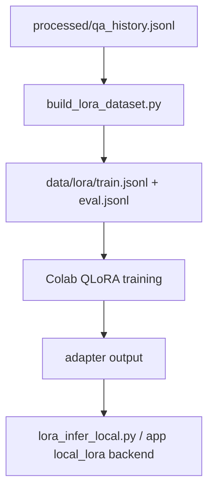
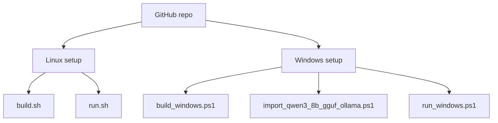
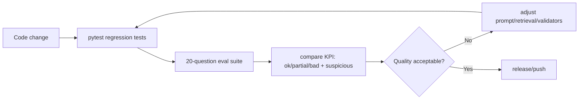

# 09. Architecture and Workflow Schemes

Ниже — сводные схемы того, как устроен проект и какие этапы были реализованы.

## 1) End-to-end pipeline



## 2) Online query path (runtime)



## 3) Source validation / anti-hallucination



## 4) LoRA workflow



## 5) Deployment matrix



## 6) Testing and regression loop



## 7) Что важно сохранять при дальнейшей доработке

- разделять качество retrieval и качество генерации;
- удерживать критические guardrail-правила;
- контролировать `suspicious_doc_numbers` как отдельную метрику риска;
- фиксировать все изменения через единый regression-run.

## 8) Final runtime schema (YandexGPT-5-lite baseline)

```mermaid
flowchart TD
    U[User in Web UI] --> A[app.py answer()]
    A --> B[score_query TF-IDF top_k=12]
    B --> C[embeddings re-rank top_n=80]
    C --> D[multi-step retrieval planner]
    D --> E[build prompt with INSTRUCT + context]
    E --> F[Yandex OpenAI endpoint]
    F --> G[Model: gpt://folder/yandexgpt-5-lite/latest]
    G --> H[LLM draft answer]
    H --> I[critical fact guard]
    I --> J[sanitize unverified refs]
    J --> K[strict sources reconstruction from matches]
    K --> L[official links + disclaimer]
    L --> M[final answer to UI]

    C --> C1{embedding failure?}
    C1 -->|yes| C2[fallback to lexical TF-IDF]
    C2 --> D
    F --> F1{SDK encoding/connection issue?}
    F1 -->|yes| F2[UTF-8 HTTP fallback + retry]
    F2 --> G
```

Recommended baseline parameters:
- backend: `yandex_openai`
- model: `yandexgpt-5-lite/latest`
- `top_k=12`
- `official_only=true`
- `embeddings_rerank=true`
- `embeddings_top_n=80`
- `multi_step_retrieval=true`
- `answer_mode=full`
