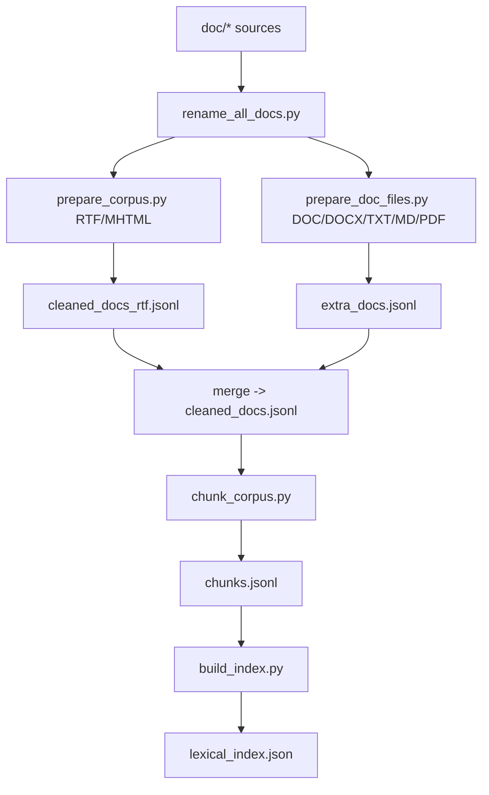
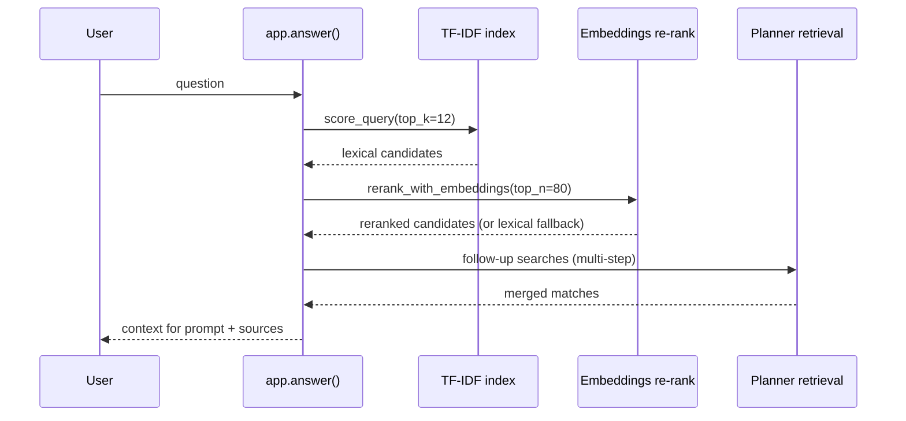

# Corpus + Retrieval Pipeline (Final)

Отдельная схема: как мы собрали корпус, как построили индекс и как retrieval работает в рантайме.

## 1) Что сделали в финальной версии

1. Нормализовали имена документов (`scripts/rename_all_docs.py`).
2. Подготовили корпус из `doc/*`:
   - RTF/MHTML через `scripts/prepare_corpus.py`;
   - DOC/DOCX/TXT/MD/PDF через `scripts/prepare_doc_files.py`.
3. Объединили в единый датасет: `processed/cleaned_docs.jsonl`.
4. Выполнили чанкинг (`scripts/chunk_corpus.py`) с юридически-ориентированной разметкой:
   - `article_number`, `article_title`, `subpoint_refs`, `cited_article_refs`.
5. Построили lexical индекс (`scripts/build_index.py`) в `processed/lexical_index.json`.
6. В рантайме добавили гибридный retrieval:
   - TF-IDF retrieval → embeddings re-rank top-N → multi-step follow-up retrieval.

## 2) Build pipeline (offline)



## 3) Runtime retrieval path (online)



### Чем и как реализовано (по шагам 45-52)

1. **`U -> A: question`**
   - Точка входа: `app.answer()`.
   - На старте нормализуем вопрос (`normalize_user_question`) и проверяем безопасность запроса (`detect_malicious_query`).

2. **`A -> T: score_query(top_k=12)`**
   - Инструмент: локальный lexical индекс `processed/lexical_index.json`, собранный `scripts/build_index.py`.
   - Функция: `score_query()` считает TF-IDF-подобный скор по токенам и метаданным чанков.
   - Дополнительно: учитываются юридические сигналы (номера НПА, ссылки на статью/пункт/подпункт, intent-теги).

3. **`T -> A: lexical candidates`**
   - Получаем первичный список релевантных чанков.
   - Затем применяем `select_diverse_matches()` и фильтр `official_only`, чтобы не перегружать контекст дубликатами и шумом.

4. **`A -> E: rerank_with_embeddings(top_n=80)`**
   - Инструмент: embeddings API (базово `text-search-query/latest`) + локальный кэш `processed/embedding_cache.json`.
   - Функция: `rerank_with_embeddings()` пересортировывает top-N кандидатов по семантической близости вопроса и фрагмента.
   - Зачем: lexical-этап хорошо ловит точные термины, embeddings улучшает переформулированные/синонимичные вопросы.

5. **`E -> A: reranked candidates (or lexical fallback)`**
   - Если embeddings недоступен (сеть/API/квота), включается fallback на TF-IDF без остановки ответа.
   - Этот режим контролируется диагностикой `embedding_diag`.

6. **`A -> P: follow-up searches (multi-step)`**
   - Инструмент: planner-подзапросы (`planner_messages`, `parse_follow_up_searches`) + повторные проходы по индексу.
   - Как делаем:
     - берем первичный контекст,
     - генерируем уточняющие поисковые формулировки,
     - достраиваем выдачу через `run_follow_up_retrieval()`,
     - объединяем результаты `merge_scored_matches()`.

7. **`P -> A: merged matches`**
   - После merge применяем структурные расширения:
     - parent-child (`expand_matches_parent_child`),
     - graph/hierarchy (`expand_matches_with_hierarchy`),
     - post-expansion rerank (если включен).
   - Итог: сохраняем больше юридически связанного контекста (не только один абзац, но и соседние части нормы).

8. **`A -> U: context for prompt + sources`**
   - На финале формируем контекст для генерации и блок источников:
     - `build_*_prompt(...)`,
     - `sources_block(...)`,
     - guardrails/sanitizer перед ответом пользователю.
   - Результат: пользователь получает не только текст ответа, но и проверяемые ссылки на НПА.

## 4) Финальные параметры baseline

- `top_k = 12`
- `official_only = true`
- `use_embeddings_rerank = true`
- `embeddings_top_n = 80`
- `multi_step_retrieval = true`
- `answer_mode = full`

## 5) Fallback-механики

- Если embeddings API недоступен: retrieval продолжает работать как TF-IDF-only.
- Если SDK даёт кодировочную ошибку (`ascii codec`): используется UTF-8 HTTP fallback.
- Если сеть/шлюз нестабилен: применяются ретраи на LLM и embeddings.

## 6) Где смотреть артефакты

- Корпус после подготовки: `processed/cleaned_docs.jsonl`
- Чанки: `processed/chunks.jsonl`
- Индекс: `processed/lexical_index.json`
- Кэш эмбеддингов: `processed/embedding_cache.json`

## 7) Команды для полного пересчёта

```bash
./build.sh
```

Проверка retrieval:

```bash
python3 scripts/test_retrieval.py --index processed/lexical_index.json --top-k 6
```
