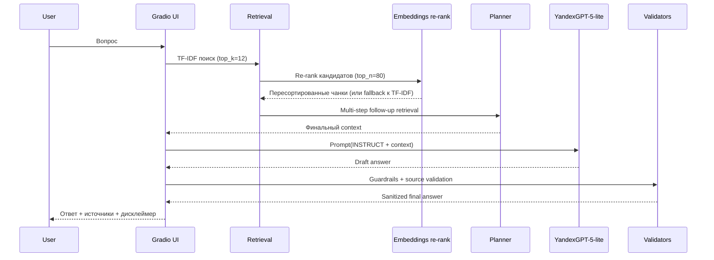

# Final Schema: YandexGPT-5-lite

## Runtime safeguards

- если `embeddings` недоступны: fallback на lexical retrieval без остановки ответа;
- если OpenAI SDK падает по кодировке (`ascii codec`): UTF-8 HTTP fallback;
- при connection/timeout: повторные попытки до fallback;
- `strict sources`: список источников пересобирается только из retrieval `matches`.

## Final baseline settings

- `llm_backend = yandex_openai`
- `yandex_model = yandexgpt-5-lite/latest`
- `top_k = 12`
- `official_only = true`
- `use_embeddings_rerank = true`
- `embeddings_top_n = 80`
- `multi_step_retrieval = true`
- `answer_mode = full`
